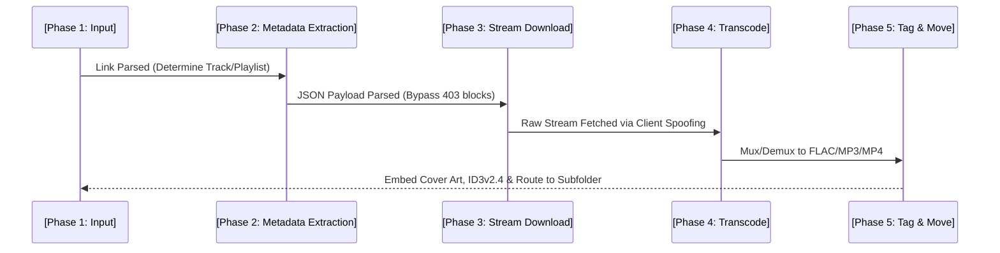

# 🏛️ Stash: The Master Engineering & Architecture Codex

Stash is an advanced, dual-platform media extraction system capable of parsing, queuing, downloading, and natively tagging high-fidelity streams from YouTube and YouTube Music. It exists as two distinct native applications: a Windows Desktop client (Electron/React 18) and a Mobile client (Android/Kotlin/Jetpack Compose). 

Building a media downloader today is vastly more complex than simply parsing a URL. Modern streaming platforms employ heavily guarded API endpoints, Proof-of-Origin (PO) tokens, Secure Audio-Video Bounded Routing (SABR), and strict TLS fingerprinting to block automated bots. 

This document serves as the absolute master reference for Stash. It details the underlying Domain-Driven architecture, the core extraction pipelines, and provides an exhaustive, explanation-heavy breakdown of the major systems: how they worked before, why they broke, and the exact engineering solutions implemented to make them robust today.

---

## 1. The 5-Phase Sequential Processing Pipeline

To guarantee system stability and prevent out-of-memory (OOM) lockups during massive batch playlist conversions (e.g., 100+ tracks), Stash enforces a strict, deterministic, sequential pipeline across both platforms.

**Why we designed it this way**: Initially, earlier iterations of media downloaders attempted to parallelize metadata fetching, downloading, and transcoding simultaneously to save time. However, running multiple `yt-dlp` instances alongside FFmpeg CPU transcoding threads resulted in massive CPU spikes and instant memory crashes on low-end Android devices. By locking the queue into a sequential state machine, the system maintains a completely fluid 60/120Hz UI response rate, regardless of the workload.

---

## 2. Platform Architecture & Domain Topology

Stash decouples heavy extraction logic from the UI layer using a Domain-Driven Design (DDD). While the platforms use entirely different programming paradigms, the logical structure is mirrored.

### 2.1 The Desktop Codebase (Windows)
**Tech Stack**: Electron, React 18, TypeScript, Node.js, Vite.

* **Frontend (Chromium Renderer)**: React UI components (`BatchItem.tsx`, `TrackCard.tsx`) rely strictly on a unified Context API.
* **Backend (Node.js Main Process)**: The `DownloadEngine.ts` wrapper spawns pure child processes for `yt-dlp.exe` and `ffmpeg.exe`. 
* **The Bridge**: The UI and Backend never touch directly. They communicate exclusively via secure Inter-Process Communication (IPC). The backend intercepts raw `stdout` terminal output, parses the telemetry regex (Speed, Percentage, ETA), and streams it to the React UI.

### 2.2 The Mobile Codebase (Android)
**Tech Stack**: Native Kotlin, Jetpack Compose, Coroutines.

* **Frontend (Compose)**: Declarative, hardware-accelerated layouts utilizing custom modifiers for effects.
* **Backend (Data Layer)**: `YoutubeDLManager.kt` acts as the engine, executing a native wrapper (yaap/youtubedl-android). Because Android restricts background tasks, the orchestrator is bound to a `DownloadForegroundService.kt` to ensure the OS does not kill the app while a 2-hour playlist is downloading.
* **Platform Constraints (Why Android is Harder)**: Scraping on a Windows PC is relatively simple because residential IPs are highly trusted. Android devices, however, suffer from **CGNAT (Carrier-Grade NAT)**, meaning thousands of mobile phones share a single IP address. If one phone triggers an API limit, all phones on that tower get blocked. Furthermore, Android lacks the native browser environments required to silently solve YouTube's JavaScript Proof-of-Work captchas.

---

## 3. The "Liquid Glass" UI/UX Engineering

Stash's signature aesthetic is its translucent, frosted acrylic interface combined with dynamic color-bloom backgrounds. 

**What was before**: The Desktop app used `framer-motion` to animate massive SVG vector paths across the screen. 
**Why it failed**: Chromium’s compositor choked. Animating `stroke-dasharray` on SVGs forced the GPU raster engine to discard and recreate high-resolution tiles on every 16ms frame, resulting in 40% CPU spikes, visual screen tearing, and `[tile_manager.cc(892)] Tile memory limits exceeded` console errors.

**How we changed it**: 
* **On Desktop**: We completely ripped out Framer Motion SVGs and built a custom, zero-CPU HTML5 `<canvas>` engine. Using pure math (`ctx.bezierCurveTo`) inside a `requestAnimationFrame` loop, CPU idle usage dropped from 40% to <0.1%.
* **On Android**: We utilized Jetpack Compose's native `Modifier.blur()` and `RenderEffect`, pushing the blur calculations directly onto the mobile GPU via `graphicsLayer` to ensure fluid transitions without draining the battery.

---

## 4. Deep Dive: Problem Solving & Engine Evolution

The core value of Stash is in how it circumvents platform restrictions. The extraction logic was rewritten multiple times to combat YouTube's evolving anti-bot measures. Here is an explanation-heavy breakdown of the systems implemented.

### 4.1 The "Error 152" Blockade & Client Cascades
**What it is**: YouTube recently deployed severe IP shadow-bans against generic web traffic (like `yt-dlp`). When a scraper requests a stream, the server throws `Error 152: Please sign in to confirm you're not a bot` or a SABR (Secure Audio-Video Bounded Routing) missing URL error.
**What was before**: The app previously used `youtube:player_client=default`. This macro appended generic Web, Music, and iOS clients to the request.
**Why it failed**: YouTube heavily scrutinizes web requests and blocks them instantly if they lack cryptographic Proof-of-Origin (PO) tokens or if the TLS handshake (JA3 fingerprint) looks like a Python bot instead of a Chrome browser.
**How we changed it**: We implemented an aggressive **Client Cascade**. We changed the extractor arguments to: `--extractor-args "youtube:player_client=tv,android,web_embedded"`.
* **Why the `tv` client?** Smart TVs lack browsers to solve captchas, so YouTube heavily whitelists the `tv` API endpoint. By spoofing a TV, we instantly bypass the IP ban.
* **The Audio Fallback Catch**: The `tv` client API *does not provide pure audio streams* (format `ba`). If we only requested audio, the `tv` client would crash. Our solution was to modify the format selector to `ba/18/b`. If pure audio is banned, Stash falls back to format `18` (360p Video + Audio, which the `tv` client *does* have). Once the video downloads, our background FFmpeg engine dynamically rips the AAC audio track directly out of the video container, ensuring a successful audio download even under a total IP ban!

### 4.2 The "Native Cookie" Session Workaround
**The Problem**: While the `tv` client bypasses standard IP blocks, users still couldn't download age-restricted videos or utilize their YouTube Premium features without logging in.
**What was before**: Older scrapers relied on headless Python scripts to extract cookies, which broke constantly on Android sandboxes (Chaquopy).
**How we changed it**: We built `CookieManager.kt` (Android) and `CookieManager.ts` (PC). These modules launch a literal, invisible native browser window (`WebView` on Android, `BrowserWindow` on Electron). The user signs into Google normally. The system then scrapes the authenticated `Set-Cookie` headers from the native browser, formats them into a Netscape `cookies.txt` file, and injects them directly into the `yt-dlp` engine. This provides perfectly authenticated, bot-proof extraction.

### 4.3 Automated Subfolder Routing Chaos
**The Problem**: A media library application needs to keep files organized. 
**What was before**: The orchestrator had a fallback condition: if a track belonged to a playlist, create a folder for that playlist. *However*, if it was just a single track, it would fall back to the "Artist Name" and create a folder for that artist. This resulted in single-track downloads generating dozens of unnecessary, isolated folders, utterly cluttering the user's hard drive.
**How we changed it**: We entirely stripped the artist fallback out of `StashOrchestrator.ts` and `YoutubeDLManager.kt`. The engine now checks explicitly for a valid `playlistName`. If it doesn't exist, it recognizes it as an isolated file and drops it cleanly into the root directory.

### 4.4 True Native Metadata Tagging vs. Post-Processing
**What was before**: The PC app originally downloaded the raw stream, and then a secondary Node.js script (`node-id3`) attempted to parse the file and inject tags. This was slow, often crashed on foreign characters, and failed to correctly embed album art for offline Android players.
**Why we changed it**: A media file isn't complete unless it feels native in a standard music app.
**How we changed it**: We ripped out the Node.js tagger entirely. We brought both Android and PC to exact parity by feeding raw embedding arguments directly into the `yt-dlp` execution pipeline:
* `--embed-metadata` and `--embed-thumbnail` natively stitch the data.
* `--parse-metadata NA:%(meta_album)s` forces playlist titles to map directly to the official ID3 "Album Title" tag.
* `--convert-thumbnails jpg` fixes a critical Android bug where modern WebP image covers fail to render in native offline media stores. By forcing standard Baseline JPEG conversion, album covers are now universally supported.

### 4.5 Android Storage Access Framework (SAF) Dilemma
**The Problem**: Android 11+ enforces "Scoped Storage," entirely preventing applications from writing raw files into the public `Downloads` or `Music` folders using standard Java `File()` commands.
**How we changed it**: We engineered a robust `StorageManager.kt` utilizing the Android SAF. The application requests a persistent URI permission from the user for a specific folder. To maintain extraction performance, the engine downloads the massive media streams into the app's internal, unrestricted cache directory first. Once the FFmpeg conversion is completely finished, it utilizes `DocumentFile` streams to smoothly copy the finalized `.mp3` or `.mp4` out into the user's chosen public directory without violating OS security protocols.

### 4.6 Telemetry & Mobile UI Throttling
**The Problem**: Exposing real-time ETA, Speed, and Percentage requires parsing the raw terminal `stdout` strings from the engine.
**How we changed it**: 
* On PC, the Node.js backend runs complex regex (`/ETA\s+([0-9:]+)/i`) and streams it flawlessly over the IPC bridge.
* On Android, piping thousands of lines of raw JSON extraction logs into Jetpack Compose state caused the main UI thread to instantly crash and drop frames. We implemented a strict Coroutine throttle inside `YoutubeDLManager.kt` that drops rapid log bursts and only emits UI state updates exactly once every 250ms (4fps). This perfectly balances a smooth, live-updating UI with zero background lag.

---

## Conclusion

Stash is an exercise in extreme resilience and cross-platform architectural parity. By shifting the heavy lifting away from unreliable third-party API wrappers and directly manipulating native binaries (FFmpeg, yt-dlp) via Domain-Driven Orchestrators, the system achieves maximum performance. 

Whether it is solving Chromium GPU leaks via zero-CPU HTML5 Math canvas engines, hijacking native WebViews for bot-proof authentication, or orchestrating complex fallback client cascades to bypass YouTube's IP blocks, Stash proves that complex media extraction can be packaged into a beautiful, fluid, consumer-grade experience on both Desktop and Mobile.
