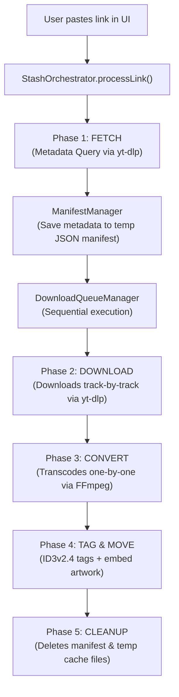

# ⚡ Stash Downloader v1.3.0


Hey there! Welcome to **Stash**—a high-performance, elegant media downloader built with Jetpack Compose Desktop for JVM. Whether you want to format-shift your favorite music tracks, playlists, albums, or videos from YouTube and YouTube Music into clean, tagged local files, Stash has got your back. 

It's fast, it's pretty, and it actually works. Let's get you set up!

---

## 🚀 How It works: The sequential pipeline

Stash runs a super stable **5-Phase Sequential Batch Pipeline** that downloads and converts everything cleanly without choking your system or getting your IP banned. 




### The 5 Phases:
1. **FETCH**: Stash parses your link (using regex in `LinkParser`) and queries metadata using `yt-dlp`. It saves this metadata to a temporary JSON manifest file.
2. **DOWNLOAD**: Tracks are downloaded sequentially (one-by-one) using `yt-dlp` to extract the best audio streams, saving them to a temporary cache.
3. **CONVERT**: Transcoding is handled one-by-one using `ffmpeg` to target your selected format (MP3/AAC) and quality (Low/Mid/High).
4. **TAG & MOVE**: Converted files are tagged with ID3v2.4 metadata (including high-resolution album artwork) using `mp3agic` and moved to your chosen output folder.
5. **CLEANUP**: All cache and manifest files are deleted, leaving a clean workspace.

---

## 🛠️ Instalation & Dependecies

Installing Stash is super easy. You have two main ways to get up and running:

### Method 1: The Standalone Installer (Recommended)
We compile a custom Windows MSI installer. The best part? **It bundles all dependecies!**
- The installer includes `yt-dlp.exe`, `ffmpeg.exe`, and `ffprobe.exe` out of the box.
- It will automatically set them up for you inside the application's resources folder. No manual PATH configuration needed!
- **Post-Install Launch:** Once the installation finishes, you can check the "Launch Stash" box, and it will open the app automaticaly.

To build the installer yourself:
```cmd
.\gradlew.bat :app:packageMsi
```
Find the MSI installer at:
`app/build/compose/binaries/main/msi/Stash-1.3.0.msi`

### Method 2: Running Locally from Source
If you are running the project from source, you'll need:
- **Java Development Kit (JDK) 17 or higher**
- **FFmpeg & yt-dlp**: You can place `yt-dlp.exe`, `ffmpeg.exe`, and `ffprobe.exe` in `app-resources/windows/` before building, or Stash will ask to install them automatically for you inside the app when it starts up!

To start the app in development mode:
```cmd
.\gradlew.bat :app:run
```

---

## ✨ Cool Features

- ⏸ **Pause & Resume**: You can pause any track in the queue to save bandwidth and resume it later. The download engine resumes from partial files seamlessly.
- 📂 **Smart Folder Organization**: Downloads automatically group into subfolders named after the Album/Playlist. Individual tracks download directly without creating subdirectories.
- 🔍 **YouTube Playlist Parsing**: Full support for playlist URLs (including watch-playlists with `&list=` parameters).
- 🔄 **Self-Updating Dependency**: Check and update `yt-dlp` directly within the app UI.

---

## ⚖️ Legal & Fair Use Status

Stash is developed strictly as an educational project and personal archiving utility.

- **No DRM Circumvention**: Stash **does not** bypass, disable, decrypt, or otherwise crack any Digital Rights Management (DRM) protection layers (such as Widevine, FairPlay, or PlayReady). 
- **Fair Use Compliant**: Stash facilitates offline format-shifting for personal use. Users are responsible for complying with the Terms of Service of the platforms and local copyright regulations.

---

## 📝 License

This project is open-source and released under the [MIT License](LICENSE).
