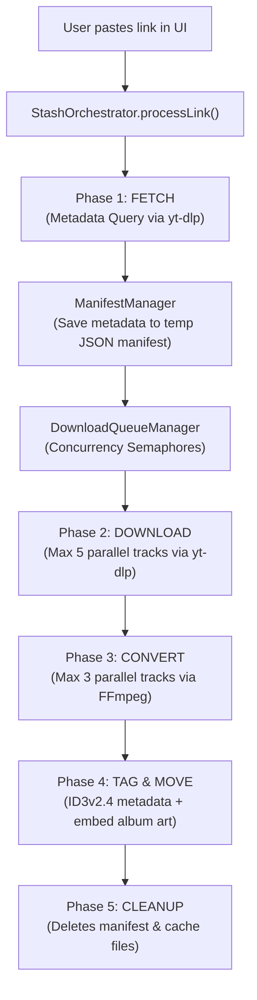

# Stash Downloader

Stash is a high-performance, elegant media downloader built with Jetbrains Compose Desktop for JVM. It allows you to download and format-shift your favorite music tracks, playlists, albums, and videos from YouTube, YouTube Music, and other media sources into high-quality, cleanly-tagged MP3, AAC, or MP4 files.

---

## Supported Sources & Future Roadmap

> [!IMPORTANT]
> **Spotify Downloads are NOT Supported**
> Currently, Stash **does not** support downloading or parsing Spotify links (tracks, playlists, or albums) in the desktop application.
> 
> **Future Roadmap**: Spotify metadata-matching download support is planned and may be integrated in a future release.

---

## Architecture & How It Works

Stash utilizes a strict **5-Phase Concurrent Batch Pipeline** designed to maximize downloading speed while maintaining stability and preventing system congestion or IP bans.



### The 5 Phases:
1. **FETCH**: The application parses the input link (via regex in `LinkParser`). Metadata is queried from the source link and stored in a temporary JSON manifest file.
2. **DOWNLOAD**: The queue processes tracks in parallel. Up to **5 concurrent downloads** are permitted using `yt-dlp` to extract the best audio streams, saving them to a temporary cache.
3. **CONVERT**: Transcoding is handled in parallel (up to **3 concurrent conversions**) using `ffmpeg` to target the user's selected format (MP3 or AAC) and quality bitrate (Low/Mid/High).
4. **TAG & MOVE**: Finished files are automatically tagged with ID3v2.4 metadata (including embedding high-resolution album artwork) using `mp3agic` and cleanly moved to the user's specified output directory.
5. **CLEANUP**: All cache and manifest files are deleted, leaving a clean workspace.

---

## Features

- ⚡ **Concurrent Execution**: High-speed, semaphore-limited downloading and conversion.
- ⏸ **Pause & Resume**: Individually pause any track in the queue to save bandwidth and resume it later. The download engine resumes from partial files seamlessly.
- 📂 **Smart Folder Organization**: Downloads automatically group into subfolders named after the Album/Playlist for batches, while individual tracks download directly without creating subdirectories.
- 🎨 **Premium Modern UI**: Built with a sleek dark-mode-ready, Glassmorphism-inspired design system.
- 🔍 **YouTube Playlist Parsing**: Full support for playlist URLs (including watch-playlists with `&list=` parameters).
- 🔄 **Self-Updating Dependency**: Check and update `yt-dlp` directly within the app UI.

---

## Setup & Installation

### Requirements
- **Java Development Kit (JDK) 17+**
- **FFmpeg & FFprobe**: Must be installed on your machine and available in your system's `PATH`.
- **yt-dlp**: Must be installed on your machine and available in your system's `PATH` (can be updated within the app).

### Running Locally
Run the application using the Gradle wrapper:
```cmd
.\gradlew.bat :app:run
```

### Packaging the Windows MSI Installer
To compile the production code and generate a standalone Windows MSI installer:
```cmd
.\gradlew.bat :app:packageMsi
```
The resulting installer is compiled with a custom installation wizard dialog box allowing custom path installation and shortcut generation. It will be located at:
`app/build/compose/binaries/main/msi/Stash-1.0.0.msi`

---

## Legal & Fair Use Status

Stash is developed strictly as an educational project and personal archiving utility.

- **No DRM Circumvention**: Stash **does not** bypass, disable, decrypt, or otherwise crack any Digital Rights Management (DRM) protection layers (such as Widevine, FairPlay, or PlayReady). 
- **Fair Use Compliant**: Stash facilitates offline format-shifting for personal use. Users are responsible for complying with the Terms of Service of the platforms and local copyright regulations.

---

## License

This project is open-source and released under the [MIT License](LICENSE).
