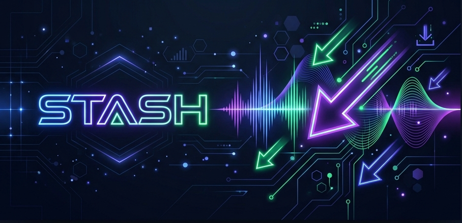
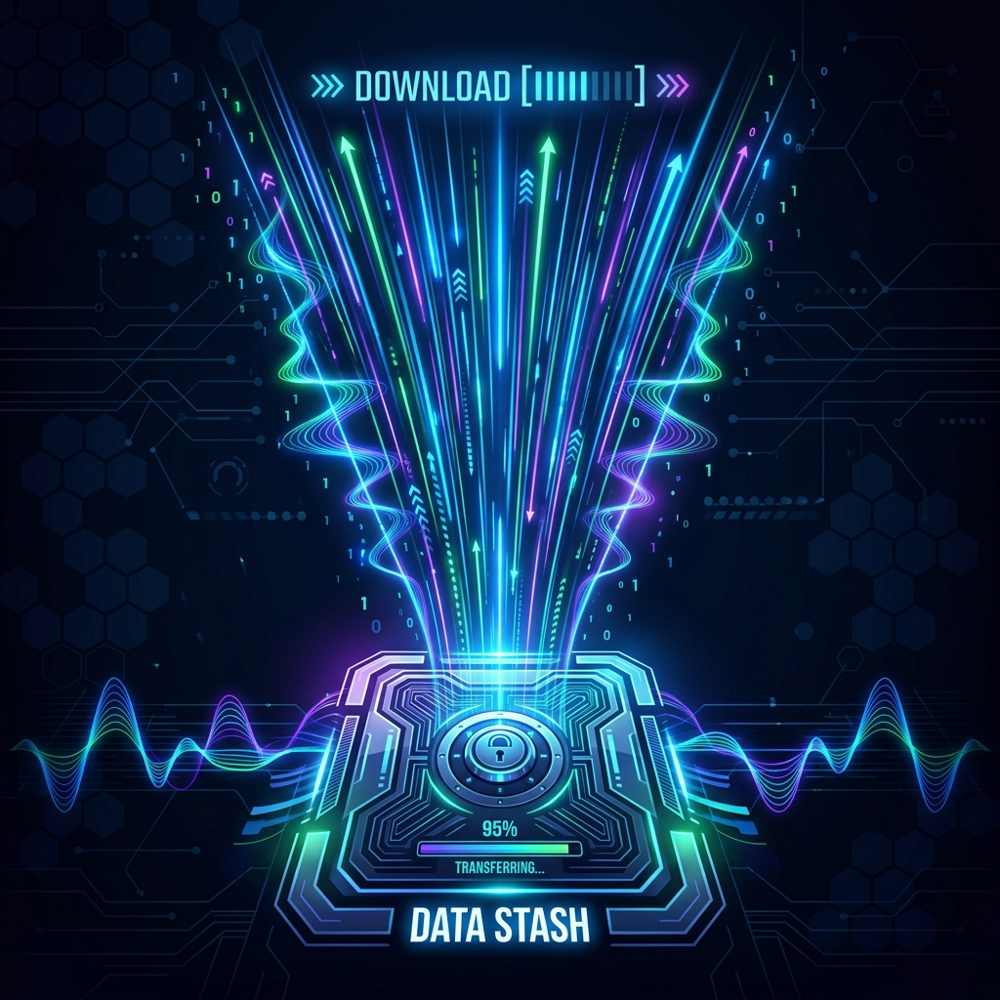
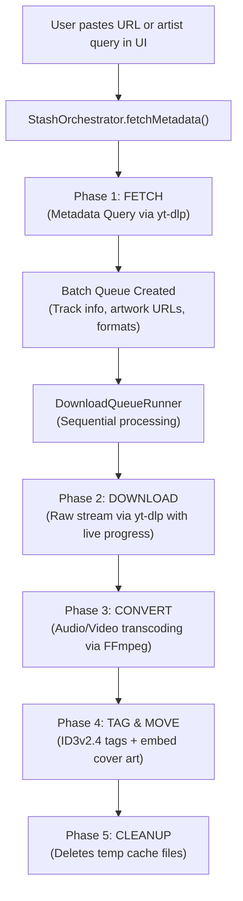

# ⚡ Stash Media Downloader v2.0 (Electron Edition)




Welcome to **Stash**—a high-performance, elegant media downloader and converter built with **Electron, Vite, React, TypeScript, and modern Vanilla CSS**. 

Whether you want to format-shift your favorite music tracks, playlists, albums, or videos from YouTube, YouTube Music, and other media sources into clean, tagged local files, Stash delivers a seamless, native desktop experience.

---

## 🚀 The 5-Phase Sequential Pipeline

Stash runs a stable, sequential batch pipeline that downloads and converts media without choking your system:





### The 5 Phases:
1. **FETCH**: Stash parses your link or artist query, querying metadata using `yt-dlp`.
2. **DOWNLOAD**: Streams are downloaded sequentially using `yt-dlp` to extract the best audio or video streams into temporary cache.
3. **CONVERT**: Transcoding is handled one-by-one using `ffmpeg` to target your selected format (MP3, AAC, FLAC, OPUS, WAV, MP4) and quality bitrate (High / Mid / Low).
4. **TAG & MOVE**: Converted files are tagged with ID3v2.4 metadata (including high-resolution album artwork) and moved to your output folder.
5. **CLEANUP**: Temp cache files are deleted automatically.

---

## 🛠️ Quick Start & Development

### Prerequisites
- **Node.js**: v18+ (Node.js v24 recommended)
- **npm**: v9+
- **Bundled Binaries**: `yt-dlp.exe`, `ffmpeg.exe`, and `ffprobe.exe` are already bundled in `app-resources/windows/`!

### 1. Install Dependencies
```bash
npm install
```

### 2. Run in Development Mode
```bash
npm run dev
```

### 3. Build & Package for Windows (.exe / .msi)
```bash
npm run package:win
```

---

## 📦 Features
- ⚡ **Multi-Platform Support**: YouTube Videos, Shorts, Playlists, YouTube Music Tracks/Albums/Playlists/Artists, and generic URLs.
- 🎨 **State-of-the-Art UI**: Glassmorphic dark aesthetic, real-time download progress with speeds and ETAs, collapsible batches, and toast notifications.
- 🎵 **Quality & Format Selection**:
  - Formats: Auto-Detect, MP3, AAC, FLAC, OPUS, WAV, MP4.
  - Presets: High (320kbps / 1080p), Mid (192kbps / 720p), Low (128kbps / 360p).
- 🏷️ **Automated ID3v2.4 Tagging**: Embedded artist, album, title, year, genre, and high-res cover art.
- 🛡️ **Built-in Tool Manager**: Built-in status checker and one-click `yt-dlp` updates.

---

## 📄 License
This project is licensed under the MIT License - see the [LICENSE](LICENSE) file for details.
